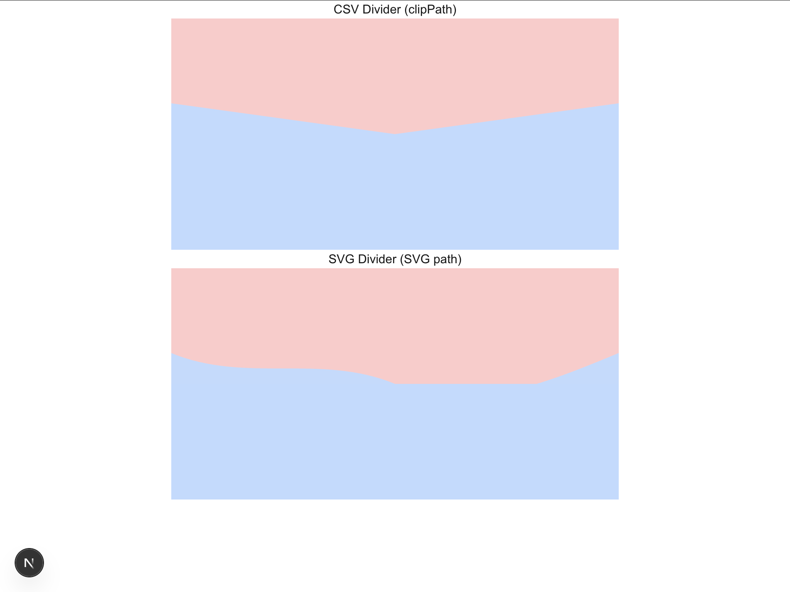

# 曲線によるdivのバウンダリー

二つのdiv要素を曲線の分割線で分割する

- 曲線をCSVで定義して分割する
- 曲線をSVGで定義して分割する

## 曲線をCSVで定義して分割する方法

### 実装例：`src/app/components/CssDivider.tsx`

このコンポーネントは、CSSの`clip-path`プロパティを使って、2つのdiv要素を曲線で分割しています。
本来はCSVで定義した座標点をJavaScriptで読み込み、`clip-path`やSVGの`<polyline>`/`<path>`に変換して描画しますが、
この例では、あらかじめ決めた曲線（多角形やベジェ曲線）を`clip-path`の値として直接指定しています。

#### ポイント
- `css-div1`と`css-div2`の間に`css-separator`を配置し、`clip-path`で曲線状の分割線を表現
- `-mt-10`や`-mt-[40px]`で上下のdivと曲線の位置をぴったり揃える
- `clip-path`の外側は透過となり、下のdivの色が見える

#### 応用
CSVで座標点を用意し、JavaScriptで読み込んで`clip-path`のpolygonやSVG pathに動的に変換することで、
任意の曲線分割も実現できます。

## 曲線をSVGで定義して分割する方法

### 実装例：`src/app/components/SvgDivider.tsx`

このコンポーネントは、SVGの`<path>`要素を使って2つのdiv要素を曲線で分割しています。
SVGのベジェ曲線（Cコマンド）を使うことで、自由な曲線を分割線として描画できます。

#### ポイント
- `svg-div1`と`svg-div2`の間に`svg-separator`（SVG）を配置し、`<path>`で曲線を描画
- SVGの高さ分だけ`-mt-[40px]`などで上に重ね、divの下端と曲線の下端を揃える
- 曲線より下側を`svg-div2`の背景色で塗りつぶすことで、2つの領域を分割

#### 応用
SVGの`<path>`のd属性を動的に生成することで、CSVや他のデータから任意の曲線を描画することも可能です。

